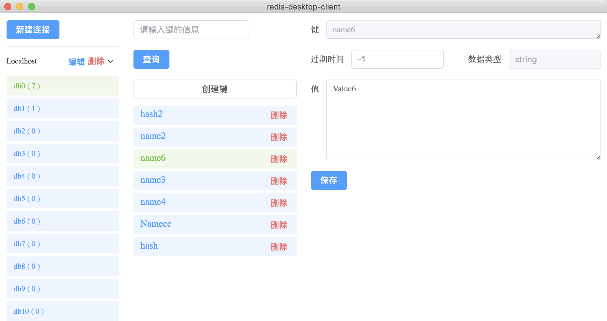
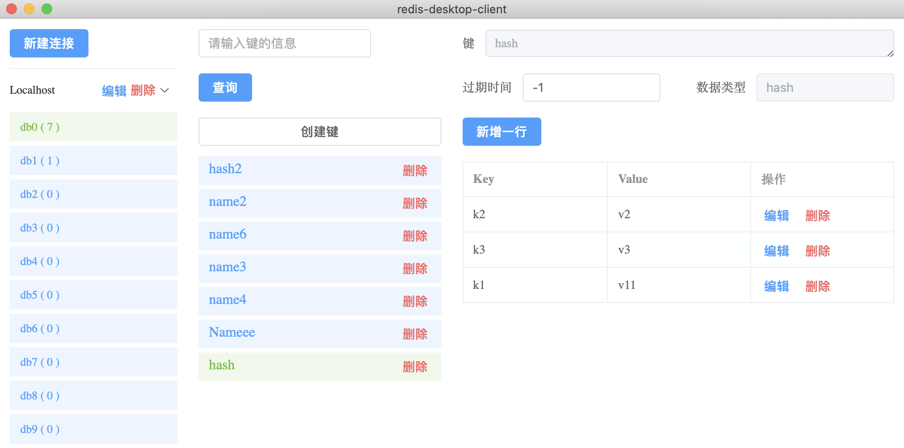

# RedisDesktopClient

> 基于Golang Wails 开发的Redis桌面工具
> 
> B站视频链接：https://www.bilibili.com/video/BV1hP411w7k5/

## 技术栈

+ 后端 ：golang、go-redis
+ 前端 ：vue3、element-plus

## 安装

1. 安装 golang 1.18 + ，下载地址： https://golang.google.cn/dl/
2. 安装 node 15 + ，下载地址：https://nodejs.org/en/
3. 安装 xcode 命令行 `xcode-select --install`
4. 安装 wails `go install github.com/wailsapp/wails/v2/cmd/wails@latest`
5. 安装 go-redis `go get github.com/go-redis/redis/v8`

## 功能模块

+ [x] 连接管理
  + [x] 连接列表
  + [x] 新建连接
  + [x] 修改连接
  + [x] 删除连接
+ [ ] 数据操作
  + [ ] 基础信息
    + [x] DB 列表
    + [ ] 详细信息
  + [x] 键列表查询
  + [x] 查询键值对
  + [x] 删除键值对
  + [x] 新增键值对
  + [x] 更新键值对
+ [ ] RedisCli

## 构建

使用 `wails build` 默认根据当前操作系统进行编译，通过 `-platform` 指定编译环境，能够实现跨平台编译

```shell
# Windows
wails build -platform=windows
# Mac
wails build -platform=darwin
# Linux
wails build -platform=linux
```

## 软件截图

+ String 类型



+ Hash 类型


